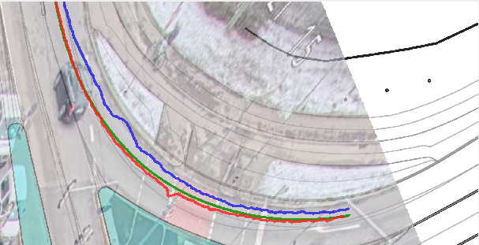
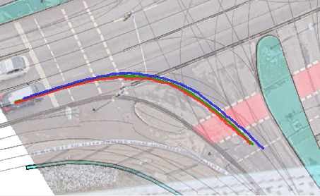
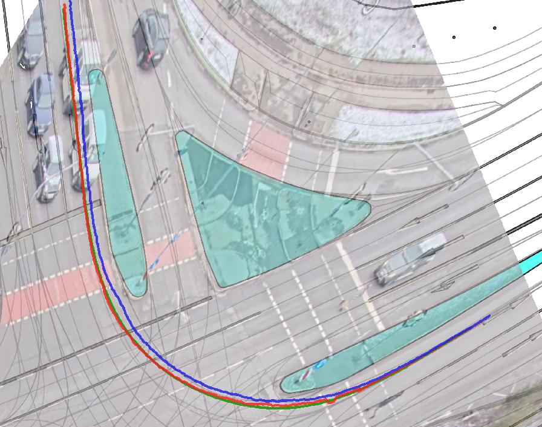

# Traffic Monitoring 

## Citation
The associated paper for this project will be published here as soon as possible. When using this software, please cite the following: 
```
@software{Strosahl_TrafficMonitoring,
author = {Strosahl, Julian},
license = {Apache-2.0},
title = {{TrafficMonitoring}},
url = {https://github.com/EFS-OpenSource/TrafficMonitoring},
version = {0.9.0}
}
```

## Trajectory Extraction from Traffic Camera
This project was developed by Julian Strosahl [Elektronische Fahrwerksyteme GmbH](https://www.efs-auto.com/) within the scope of the research project
[SAVeNoW](https://www.bmvi.de/SharedDocs/DE/Artikel/DG/AVF-projekte/savenow.html) (Project Website [SAVe:](https://save-in.digital/))

<p align="center">
    
</p>

This repository includes the Code for my Master Thesis Project about Trajectory Extraction from a Traffic Camera at an existing
traffic intersection in [Ingolstadt](https://osm.org/go/0JET~re9E)

The project is separated in different parts, at first a toolkit for capturing the live RTSP videostream from the camera.
[see here](./camera_stream_recording/README.md)

The main project part is in this [folder](./traffic_monitoring) which contains a python script for training, evaluating and running a neuronal
network, a tracking algorithm and extraction the trajectories to a csv file.

The training results (logs and metrics) are provided [here](./training_log_results/README.md)

Example videos are provided [here](./example_videos). You need to use [Git LFS](https://git-lfs.github.com/) for access the videos.

## Installation
1. Install [Miniconda](https://docs.conda.io/en/latest/miniconda.html)
2. Create Conda environment from existing file
```
conda env create --file environment.yml --name <your-env-name>
```
This will create a conda environment with your env name which contains all necessary python dependencies and OpenCV.

[detectron2](https://github.com/facebookresearch/detectron2) is also necessary. You have to install it with for CUDA 11.0
For other CUDA version have a look in the installation instruction of detectron2.

```
python -m pip install detectron2 -f \
  https://dl.fbaipublicfiles.com/detectron2/wheels/cu110/torch1.7/index.html
```
3. Provide the Network Weights for the Mask R-CNN:
- Use [Git LFS](https://git-lfs.github.com/) to get the [model_weights](./traffic_monitoring/model_weights) in the right folder and download them.
- If you don't want to use GIT LFS, you can download the weights and store them in the [model_weights](./traffic_monitoring/model_weights) folder. You can find two different versions of weights, one default [model 4 cats](https://drive.google.com/file/d/1ighKwkCM24oC5ZtSd5Wn3nFJF-LtcSUb/view?usp=sharing) is trained on segmentation 4 different categories (Truck, Car, Bicycle and Person) and the other [model 16 cats](https://drive.google.com/file/d/1h3ZiJZgoKQ211ZSVRC6IKuVpXNZJBIs2/view) is trained on 16 categories but with bad results in some categories.

## Getting Started Video

If you don't have a video just capture one here [Quick Start Capture Video from Stream ](captureVideostream/README.md)

For extracting trajectories `cd traffic_monitoring` and run it on a specific video. If you don't have one, just use this provided demo video:

```
python run_on_video.py --video ./videos/2021-01-13_16-32-09.mp4
```

The annotated video with segmentations will be stored in [videos_output](./traffic_monitoring/videos/video_output) and the trajectory file in [trajectory_output](./traffic_monitoring/videos/trajectory_output). The both result folders will be created by the script.

The trajectory file provides following structure: 

|  frame_id | category  | track_id  | x  | y | x_opt | y_opt |
|---|---|---|---|---|---|---|
| 11  | car  | 1  | 678142.80 | 5405298.02 | 678142.28| 5405298.20
| 11  | car  | 3 | 678174.98 | 5405294.48 | 678176.03 | 5405295.02
| ... | ... | ... | ... | ... | ... | ... |
| 19 | car  | 15 | 678142.75 | 5405308.82 | 678142.33 | 5405308.84|

**x** and **y** use detection and the middle point of the bounding box(Baseline, naive Approach), **x_opt** and **y_opt** are calculated by segmentation and estimation of a ground plate of each vehicle (Our Approach).

## Georeferencing

The provided software is optimized for one specific research intersection. You can provide a intersection specific dataset for usage in this software by changing the points file in [config](./traffic_monitoring/config).

## Quality of Trajectories

14 Reference Measurements with a measurement vehicle with dGPS-Sensor over the intersection show a deviation of only 0.52 meters (Mean Absolute Error, MAE) and 0.69 meters (root-mean-square error, RMSE)

The following images show the georeferenced map of the intersection with the measurement ground truth (green), middle point of bounding box (blue) and estimation via bottom plate (concept of our work) (red)





The evaluation can be done by the script `evaluation_measurement.py`. The trajectory files for the measurement drives are prepared in the [data/measurement] folder. Just run 

```
python evaluation_measurement.py 
```
for getting the error plots and the georeferenced images.

## Own Training

The segmentation works with [detectron2](https://github.com/facebookresearch/detectron2) and with an own training. If you want to use your own dataset to improve segmentation or detection you can retrain it with 

```
python train.py
```
The dataset, which was created as part of this work, is not yet publicly available. 
You just need to provide training, validation and test data in [data](data/dataset). The dataset needs the COCO-format. For labeling you can use [CVAT](https://github.com/jul095/cvat) which provides pre-labeling and interpolation

The data will be read by [ReadCOCODataset](./traffic_monitoring/read_dataset/ReadCOCODataset.py). In line 323 is a mapping configuration which can be configured for remap the labeled categories in own specified categories.

If you want to have a look on my training experience explore [Training Results](./training_log_results/README.md)

## Quality of Tracking
If you want only evaluate the Tracking algorithm SORT vs. Deep SORT there is the script `evaluation_tracking.py` for evaluate only the tracking algorithm by [py-motmetrics](https://github.com/cheind/py-motmetrics). You need the labeled dataset for this.

## References

### Segmentation (Mask R-CNN)
- Y. Wu, A. Kirillov, F. Massa, W.-Y. Lo und R. Girshick, [Detectron2](https://github.com/facebookresearch/detectron2), 2019.
- K. He, G. Gkioxari, P. Dollár and R. Girshick, "Mask R-CNN," in IEEE Transactions on Pattern Analysis and Machine Intelligence, vol. 42, no. 2, pp. 386-397, 1 Feb. 2020, doi: 10.1109/TPAMI.2018.2844175.
### Tracking
- N. Wojke, A. Bewley and D. Paulus, "Simple online and realtime tracking with a deep association metric," 2017 IEEE International Conference on Image Processing (ICIP), 2017, pp. 3645-3649, doi: 10.1109/ICIP.2017.8296962.
- ZQPei, [Deep Sort with PyTorch](https://github.com/ZQPei/deep_sort_pytorch), 2020.
### Georeferencing
- pyproj4, [Python interface to PROJ](https://github.com/pyproj4/pyproj), 2020.
### Related Work

- A. Clausse, S. Benslimane and A. de La Fortelle, "Large-Scale extraction of accurate vehicle trajectories for driving behavior learning," 2019 IEEE Intelligent Vehicles Symposium (IV), 2019, pp. 2391-2396, doi: 10.1109/IVS.2019.8814095.
- D. Notz, F. Becker, T. Kühbeck and D. Watzenig, "Extraction and Assessment of Naturalistic Human Driving Trajectories from Infrastructure Camera and Radar Sensors," 2020 IEEE 16th International Conference on Automation Science and Engineering (CASE), 2020, pp. 455-462, doi: 10.1109/CASE48305.2020.9216992.


## Acknowledgment
This work is supported by the German Federal Ministry of Transport and Digital Infrastructure (BMVI) within the *Automated and Connected Driving* funding program under Grant No. 01MM20012F (SAVeNoW).

## License
TrafficMonitoring is distributed under the Apache License 2.0. See [LICENSE](./LICENSE) for more information.


