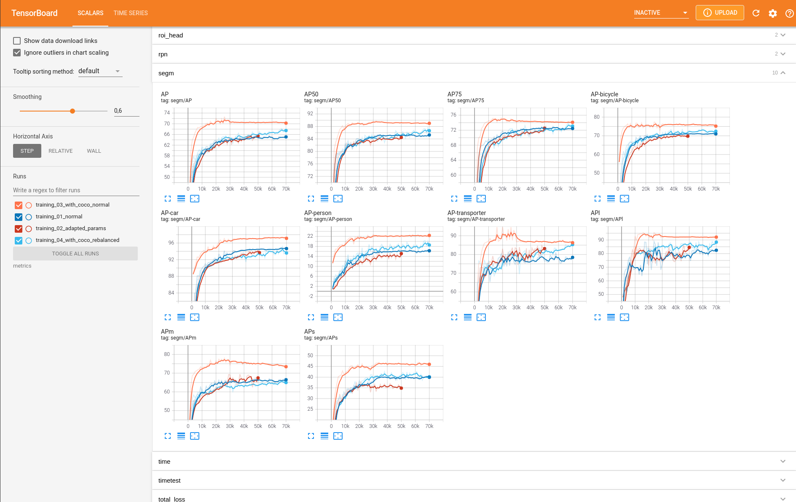

# Training Results

The training was done by a Nvidia GeForce RTX 3090 on a server. I prepare the log data in the detectron2-format and
the tensorboard log format. You can compare and explore the results the different training experiments with following command.

```
tensorboard --logdir metrics
```
If this commando not works just run `pip install tensorboard==2.4.1`
This will open a tensorboard session using the metrics in the given folder. Now you can compare the different runs with each other.



You can also explore the separate loss of each part of the Mask R-CNN for instance the class loss.